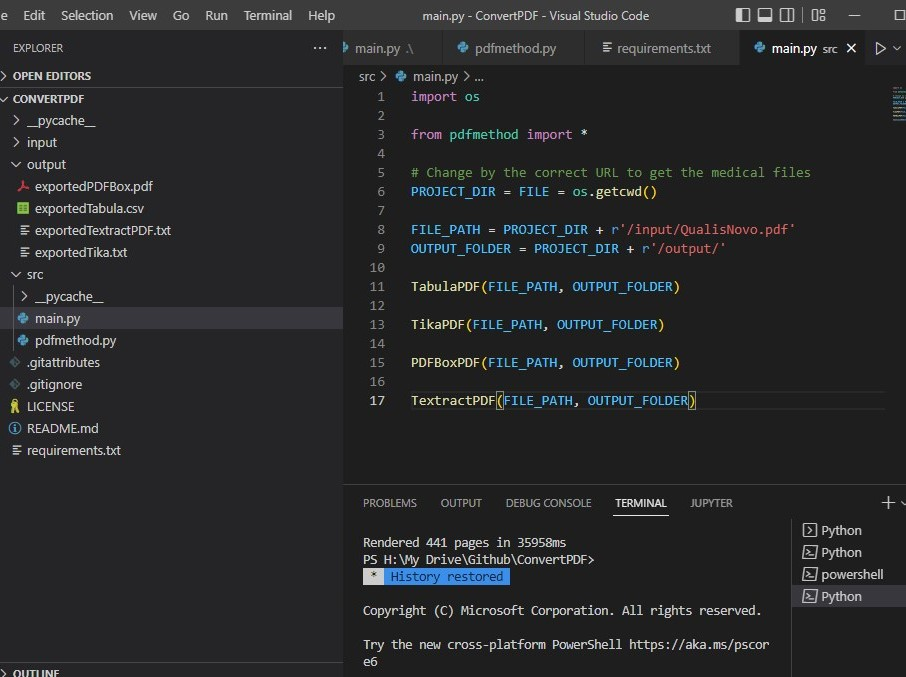

<h1 align="center">
   <p> ConvertPDF 🐍</p>
</h1>

<br>

<h1 align="center">
  
</h1>

---
## 🧾 About
**ConvertPDF** is a Python project to extract PDF content (text, images, tables) supported by Tabula, Tika, PDFBox, and TextractPDF libraries. 

---
## 🕖 Versioning
- ConvertPDF v1.0 (relased in 19/02/2022)

---
## ✅ Main features
- [x] Load PDF file.
- [x] Process PDF with Tabula. 
- [x] Process PDF with Tika. 
- [x] Process PDF with PDFBox. 
- [x] Process PDF with TextractPDF. 

---
## 🔧 Technology
- [Python](https://www.python.org/) 💚

---
## 👨‍💻 How to Setup
Download and install: 
 - [Python 3.7.7](https://www.python.org/downloads/release/python-377/)
 - [Visual Studio Code 1.67.2](https://code.visualstudio.com/Download)
    
```bash
  # Clone the project
  $ git clone https://github.com/abelgonzalez/ConvertPDF.git
```
```bash
  # Enter directory
  $ cd ConvertPDF
```
 
---
## 😎 How to Run
 
- In root folder (**ConvertPDF**) run:
  ```bash
    # Run
    $ python main.py
  ```

---
## 👉 Additional information
* In case of sensitive bugs like security vulnerabilities, don't hesitate to contact me at abelgodev@gmail.com instead of using the issue tracker. I value your effort to improve the security and privacy of this project!

---
## 📝 License
This project is under the MIT license. See the file <a href="https://github.com/abelgonzalez/ConvertPDF/LICENSE">LICENCE</a> for more details.

---
## 🧑‍💻 Autor
<p align="center">Done with 💙 by Abel González Mondéjar</p>


[](https://www.linkedin.com/in/abelgonzalezmondejar/) 
